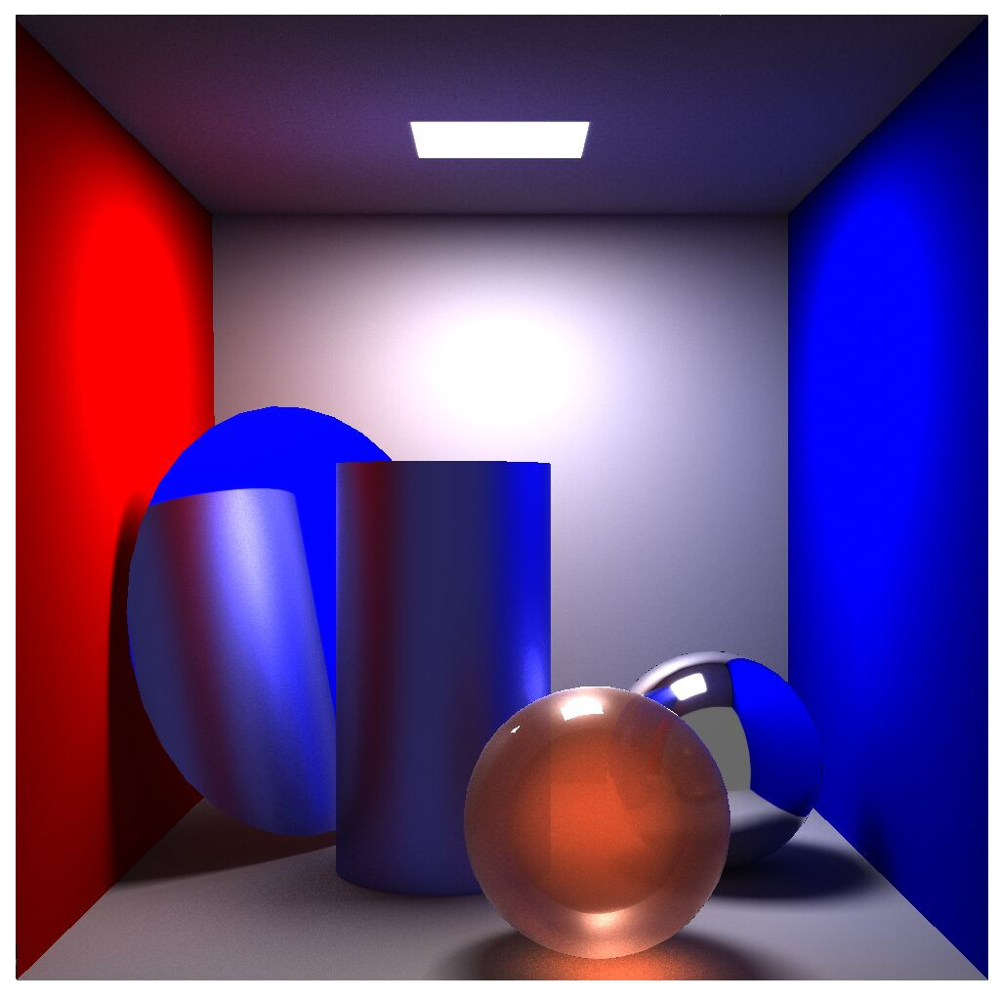
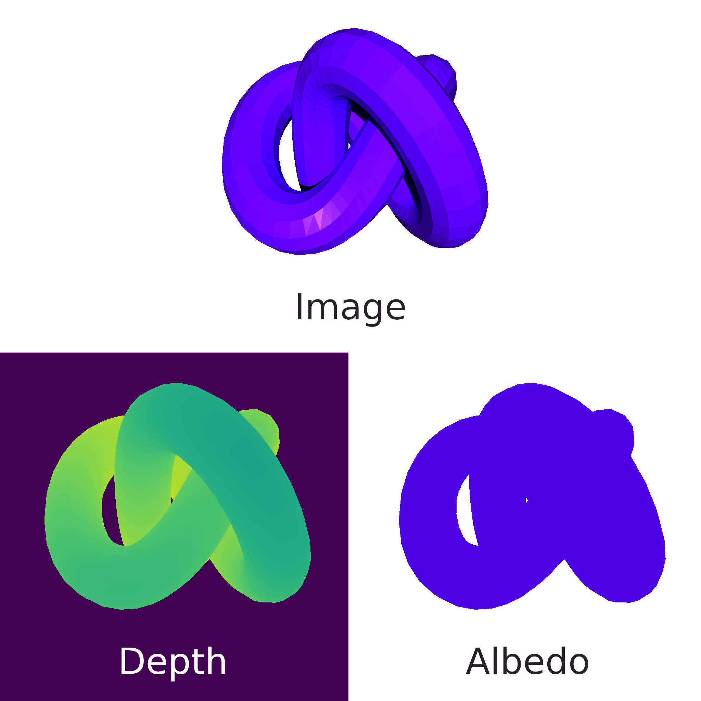
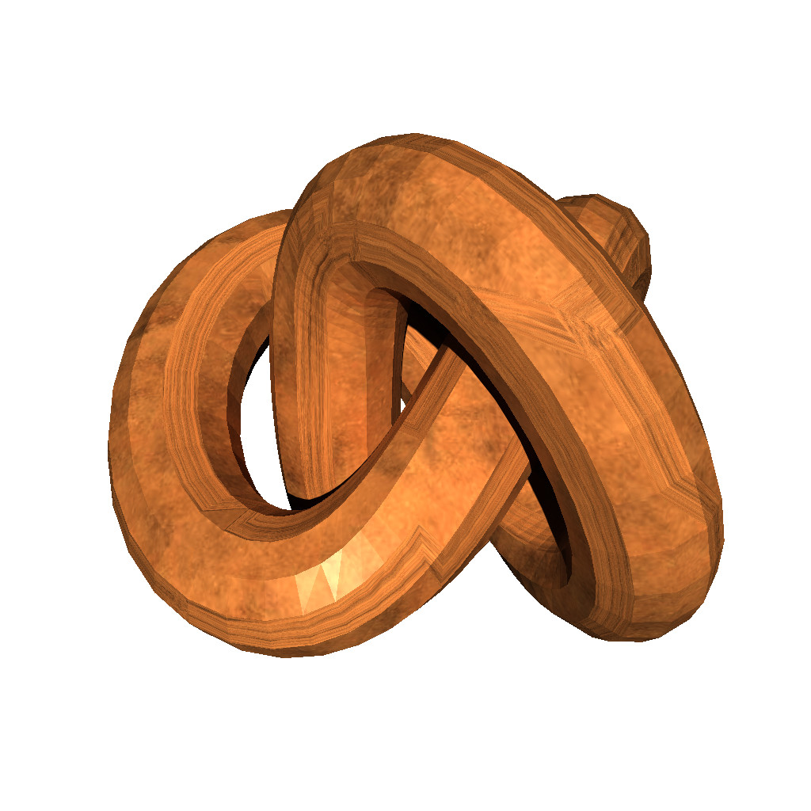
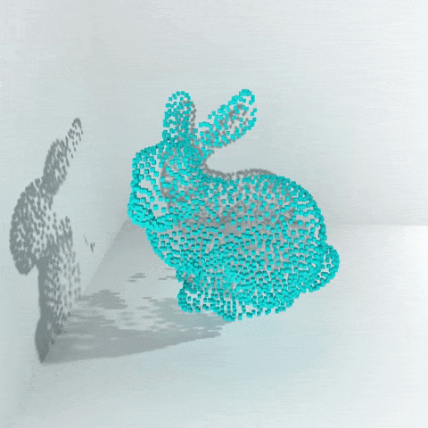
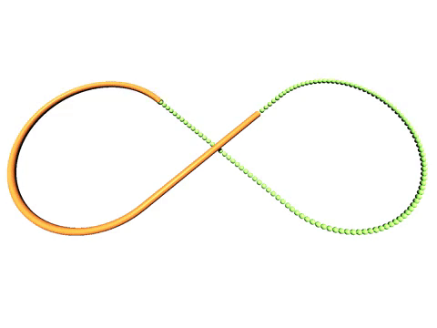

<!--  -->
<!--  -->


---

# This fork: MALIBU3D paper figures

This is a personal fork used to generate Blender figures for the MALIBU3D paper.
See [`CLAUDE.md`](CLAUDE.md) for the pipeline. The upstream library documentation
continues below.

`python scripts/tile_report.py` regenerates `TILES.md` — a measured inventory of
every delivered tile (class breakdowns, terrain, location, annotation coverage).
It writes into the drop directory, `data/malibu3d/.../blender_export/`, not into
the repo: it describes one delivery rather than the pipeline, and `data/` is
gitignored, so it is a data artifact and is deliberately not version-controlled.
Regenerate it after every new drop.

## Tile assignments for paper figures

Hand-picked by Damien, 2026-08-12. These are the tiles judged most promising for
each figure; the **Measured** column is the supporting evidence from the caches,
not a second opinion. Percentages are shares of *points*.

### Land cover

| Tile | Why | Measured |
|---|---|---|
| `D068_AF-S1-6` | hilly Vosges, agricultural | 68.9 M pts, 65.7 pts/m² — the biggest and densest tile. Agricultural soil 8.9%, vineyard 0.4%, deciduous 22.9%, relief 106 m over 264–397 m |
| `D075_AA-S2-2` | champs + vignes + autoroute + maisons | all four present: agricultural soil 23.2%, vineyard 2.4%, impervious 3.7%, building 0.5% |
| `D075_FU-S1-10` | LVMH | suburban, building 5.8%, deciduous 33.9%. Carries `strength` and both ROADS + RAILROADS |
| `D075_UF-S1-2` | bois de Boulogne + Seine | deciduous 41.2% + coniferous 3.7%; the Seine is 4.0% aquatic habitat but only **0.2% water points** — see note below |

### Forest

| Tile | Why | Measured |
|---|---|---|
| `D068_FF-S1-16` | forested valley with clearings — too dense? | **yes, it is dense**: 44.7 M pts at 42.6 pts/m², ~2.5× the Paris tiles. Habitat is 90.6% forest against only 4.1% open, so the clearings are a small minority |
| `D068_UF-S1-23` | quarry on a hillside | deciduous 37.7%, building 0.5%, relief 131 m over 464–606 m |

### Road graph

| Tile | Why | Measured |
|---|---|---|
| `D068_UU-S1-12` | Strasbourg streets | building 35.6%, impervious 27.6%. **ROADS + RAILROADS** — the only road-graph candidate with two networks |
| `D075_UU-S1-4` | Châtelet | building 42.2%, impervious 20.6%, ROADS only |
| `D075_UU-S1-17` | Opéra | building 51.1% — the most built-up tile in the set, ROADS only |
| `D075_UU-S1-3` | Tour Eiffel | building 8.0%, impervious 25.0%, bridge 1.9%. Tallest structure measures 321 m. Also carries `strength` |

### Natural habitat

| Tile | Why | Measured |
|---|---|---|
| `D068_FF-S1-16` | forested valley with clearings, as a backdrop behind the distribution figure | best-annotated tile for this task: only 5.3% habitat Void, 90.6% forest |

Intended treatment: `natural_habitat` → grayscale → semi-transparent white overlay.
**A white overlay and the `brightness` control are not equivalent** — see
"Backdrops" below.

### Diversity

| Tile | Why | Measured |
|---|---|---|
| `D073_NN-S1-4` | glacier | 2536–3380 m, habitat 80.4% aquatic / 19.4% mineral. Semantic is **62.5% Void** — unusable as a semantic figure |
| `D073_NN-S1-5` | mountain above the treeline | 1963–2477 m, habitat 76.3% open / 22.5% mineral, no forest class at all |
| `D075_UU-S1-4` | Châtelet | as above |
| `D075_UU-S1-3` | Tour Eiffel | as above |
| `D075_UU-S1-17` | Opéra | as above |

### Unassigned

Delivered 2026-08-12 and not yet earmarked for a figure. Both are in Haut-Rhin,
both `test` split, and both are the **first tiles to arrive with `strength`
(lidar intensity) included** rather than needing it back-filled.

| Tile | What is in it | Measured |
|---|---|---|
| `D068_UN-S1-28` | town edge meeting open farmland | 28.4 M pts over 1536×1024 m, the largest tile in the set. Agricultural soil 24.5%, herbaceous 19.4%, impervious 14.9%, building 10.0%. ROADS + RAILROADS. 295–326 m, flat (25 m relief) |
| `D068_FA-S1-26` | wooded hills with farmland | 14.9 M pts over 1024×512 m at 28.5 pts/m². Deciduous 25.6%, herbaceous 22.1%, agricultural soil 11.2%. 588–801 m, 177 m relief. **ROADS + TRANSMISSION_LINES** — the first power-line graph delivered |

`D068_FA-S1-26` is the only tile carrying a transmission-line network, so it is
the sole candidate for any figure showing that third network type. `D068_UN-S1-28`
is the only tile mixing a substantial built-up share with a substantial
agricultural one, which no currently assigned land cover tile does.

### Notes on the selection

- **`D073_NN-S1-4` was listed twice**, as both "glacier" and "mountain above the
  treeline". Those are two different tiles: `NN-S1-4` is the glacier (80% aquatic,
  2536–3380 m) and **`NN-S1-5`** is the one above the treeline (76% open, 22%
  mineral, 1963–2477 m). The table above assumes that was the intent — correct it
  if not.
- **Four tiles carry no habitat labels at all** — `D075_AA-S2-2`, `D075_UU-S1-4`,
  `D075_UU-S1-17` are 100% Void and `D068_UU-S1-12` is 99.7%. Fine for the land
  cover and road figures they are assigned to, but none can serve a habitat panel.
- **The Seine in `D075_UF-S1-2` is thin in point terms** (0.2%): water returns
  almost no lidar, so a river reads as an *absence* of points rather than a
  coloured surface. That can look good — a clean empty band — but it will not
  carry a water class colour.
- **`D068_AF-S1-6` is 36% semantic Void**, the highest of the land cover set. At
  68.9 M points it is also the slowest tile to work with.

### Backdrops

To place a render behind a plot, wash it toward white — do **not** raise
`brightness`. They are different operations:

- `brightness` is a gain: it scales shadows and highlights by the same factor, so
  contrast is unchanged and the bright end clips. Matching the page brightness of
  a 0.70 wash needed ×5.8, which blew 72.8% of the cloud to flat white while
  *raising* contrast. It also feeds the albedo *before* shading, so AO and shadows
  keep their full depth however far it is pushed.
- A wash blends every pixel a fixed fraction toward white, so absolute contrast
  falls uniformly by (1 − strength), blacks lift and nothing clips.

```bash
python scripts/backdrop.py <render>.png -o backdrop.png --strength 0.7 --gray
```

Equivalent to a semi-transparent white rectangle in LaTeX, but it iterates in
milliseconds, is visible in the file itself, and keeps PDF transparency groups out
of a camera-ready figure. `--keep-alpha` fades via alpha instead, which is exactly
the same thing on a white page and stays correct on any other background.

**Caveat for the habitat backdrop:** desaturating `natural_habitat` on
`D068_FF-S1-16` collapses its two dominant classes — 75% of the tile — to
luminances 0.061 apart, and two further pairs to under 0.05. After a wash those
gaps shrink by another factor of ~3. The backdrop will read as undifferentiated
grey texture, so it must not be captioned as showing habitat classes. If it is
purely decorative, the existing `grayscale` variant (photographic RGB, desaturated)
looks better and claims less; if the habitat structure needs to be visible, keep it
in colour and let the wash do the work.

---

## Introduction
Blendify is a lightweight Python framework that provides a high-level API for creating and rendering scenes with Blender. Developed with a focus on 3D computer vision visualization, Blendify simplifies access to selected Blender functions and objects.

Key features of Blendify:

1. **Simple interface:** Blendify provides a user-friendly interface for performing common visualization tasks without having to dive into the complicated Blender API.

2. **Easy integration:** Blendify seamlessly integrates with development scripts, implementing
commonly used routines and functions:
    * native support of point clouds, meshes, and primitives;
    * support of per-vertex colors and textures;
    * advanced shadows with shadow catcher objects;
    * video rendering with smooth camera trajectories;
    * support for common camera models;
    * import and export of .blend files for deeper integration with Blender.

3. **Quick start:** Blendify is easy to get started with and does not require a standalone Blender installation. All you need to do is run `pip install blendify`.


## Installation instructions
### Install from pip
```bash
pip install blendify
```
### Optional requirements
```bash
pip install blendify[utils / examples / docs / all]
```

Running examples 4 and 5 requires [PyTorch](https://pytorch.org/) with [PyTorch3D](https://github.com/facebookresearch/pytorch3d/blob/main/INSTALL.md).

Running example 5 requires SMPL model files, please refer to the installation instructions in 
[README](https://github.com/vchoutas/smplx#downloading-the-model).


## Quick Start
```python
# Script to render cube
from blendify import scene
from blendify.materials import PrincipledBSDFMaterial
from blendify.colors import UniformColors
# Add light
scene.lights.add_point(strength=1000, translation=(4, -2, 4))
# Add camera
scene.set_perspective_camera((512, 512), fov_x=0.7, quaternion=(0.82, 0.42, 0.18, 0.34), translation=(5, -5, 5))
# Create material
material = PrincipledBSDFMaterial()
# Create color
color = UniformColors((0.0, 1.0, 0.0))
# Add cube mesh
scene.renderables.add_cube_mesh(1.0, material, color)
# Render scene
scene.render(filepath="cube.png")
```


## Examples
<table>
  <tr align="center">
    <td><a href="examples/01_cornell_box.py"><b>Cornell Box</b></a></td>
    <td><a href="examples/02_color_albedo_depth.py"><b>Color, albedo and depth</b></a></td>
  </tr>
  <tr align="center">
    <td></td>
    <td></td>
  </tr>
  <tr align="center">
    <td><a href="examples/03_mesh_with_texture.py"><b>Mesh with texture</b></a></td>
    <td><a href="examples/04_camera_colored_point_cloud.py"><b>Camera colored point cloud</b></a></td>
  </tr>
  <tr align="center">
    <td></td>
    <td></td>
  </tr>
  <tr align="center">
    <td><a href="examples/05_smpl_movement.py"><b>SMPL movement</b></a></td>
    <td><a href="examples/06_nurbs_trajectory.py"><b>NURBS trajectory</b></a></td>
  </tr>
  <tr align="center">
    <td></td>
    <td></td>
  </tr>
</table>


## Works that use blendify
* V. Lazova, E. Insafutdinov, G. Pons-Moll: [360-Degree Textures of People in Clothing from a Single Image](https://virtualhumans.mpi-inf.mpg.de/360tex/)
in 3DV'19
* B.L. Bhatnagar, X. Xie, **I. Petrov**, C. Sminchisescu, C. Theobalt, G. Pons-Moll: 
  [BEHAVE: Dataset and Method for Tracking Human Object Interactions](https://virtualhumans.mpi-inf.mpg.de/behave/), in CVPR'22
* X. Zhang, B.L. Bhatnagar, **V. Guzov**, S. Starke, G. Pons-Moll: 
  [COUCH: Towards Controllable Human-Chair Interactions](https://virtualhumans.mpi-inf.mpg.de/couch/), in ECCV'22
* G. Tiwari, D. Antic, J. E. Lenssen, N. Sarafianos, T. Tung, G. Pons-Moll: [Pose-NDF: 
Modeling Human Pose Manifolds with Neural Distance Fields](https://virtualhumans.mpi-inf.mpg.de/posendf/), in ECCV'22
* **I. Petrov**, R. Marin, J. Chibane, G. Pons-Moll: [Object pop-up: Can we infer 3D objects and their poses from human interactions alone?](https://virtualhumans.mpi-inf.mpg.de/object_popup/), in CVPR'23

## Contributors
Blendify is written and maintained by [Vladimir Guzov](https://github.com/vguzov) and [Ilya Petrov](https://github.com/ptrvilya).


## Acknowledgments
We thank Verica Lazova for providing her Blender rendering scripts. 
Our code for processing point clouds is mostly based on the amazing [Blender-Photogrammetry-Importer][BPI] addon.


## License
The code is released under the [GNU General Public License v3][GNU GPL v3].

The Python logo is trademark of Python Software Foundation.
The Blender logo is a registered property of Blender Foundation.
[Blender-Photogrammetry-Importer][BPI] is distributed under the [MIT License][BPI license]. 
Blender is released under the [GNU General Public License v3][GNU GPL v3]. 

[GNU GPL v3]: https://www.gnu.org/licenses/gpl-3.0.html
[BPI]: https://github.com/SBCV/Blender-Addon-Photogrammetry-Importer
[BPI license]: https://github.com/SBCV/Blender-Addon-Photogrammetry-Importer/blob/master/README.md
